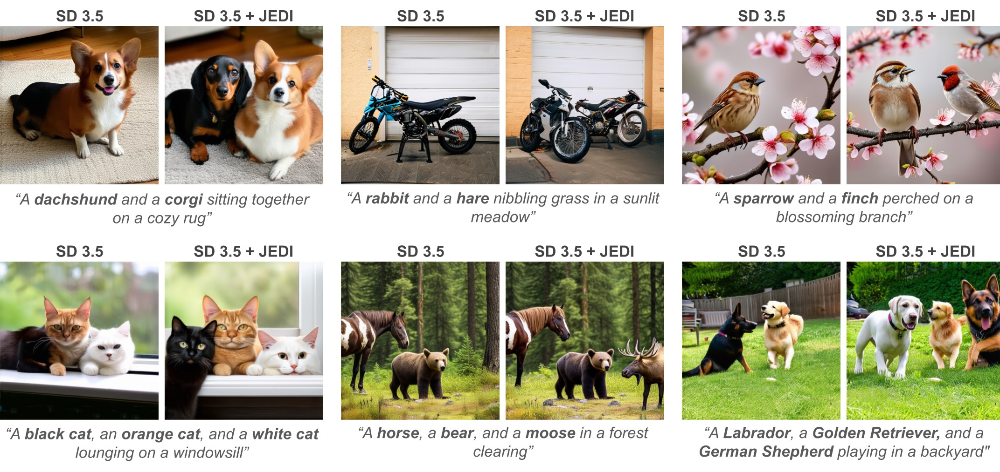

# JEDI: The Force of Jensen-Shannon Divergence in Disentangling Diffusion Models

[](https://ericbill21.github.io/JEDI/) [](https://arxiv.org/abs/2505.19166)

><p align="center">

>[Eric Tillmann Bill](https://www.linkedin.com/in/ericbill21/), [Enis Simsar](https://enis.dev/), [Thomas Hofmann](https://da.inf.ethz.ch/people/ThomasHofmann)

></p>
>
> We introduce JEDI, a test-time adaptation method that enhances subject separation and compositional alignment in diffusion models without requiring retraining or external supervision. JEDI operates by minimizing semantic entanglement in attention maps using a novel Jensen-Shannon divergence based objective. To improve efficiency, we leverage adversarial optimization, reducing the number of updating steps required. JEDI is model-agnostic and applicable to architectures such as Stable Diffusion 1.5 and 3.5, consistently improving prompt alignment and disentanglement in complex scenes. Additionally, JEDI provides a lightweight, CLIP-free disentanglement score derived from internal attention distributions, offering a principled benchmark for compositional alignment under test-time conditions.

Key highlights:
- ✅ Training-free and model-agnostic
- ✅ Compatible with models like Stable Diffusion 1.5 and 3.5
- ✅ Improves image alignment to compositional prompts
- ✅ Introduces a lightweight, CLIP-free disentanglement score from internal attention distributions


<p align="center">
      
    <br>
    <!-- Our training-free method combines a contrastive objective with test-time optimization, significantly improving how models such as Imagen and Stable Diffusion generate images with text prompts consisting of multiple concepts or subjects such as "a bear and a horse"  -->
</p>


## 🚀 Setup

### 1. Clone the Repository
```
git clone https://github.com/ericbill21/JEDI.git
```

### 2. Install Dependencies
```
pip install -r JEDI/requirements.txt
```

### 3. Hugging Face Diffusers
JEDI builds on Hugging Face's 🤗 diffusers library to access diffusion models such as Stable Diffusion 3.5.


## 🔧 Usage

<p align="center">  <br> <i>Example generations from Stable Diffusion 3.5 with and without JEDI</i> </p>

Use the provided `sample.ipynb` notebook to run JEDI on your prompts.

### Example
For a prompt like:
```
"A horse and a bear in a forest"
```

JEDI needs the subject token indices from the respective text encoders. For Stable Diffusion 3.5, both T5 and CLIP are used:
```
jedi = JEDI(
    t5_ids = [[1], [5]],      # Indices of "horse" and "bear" in T5 tokens
    clip_ids = [[2], [5]],    # Indices of "horse" and "bear" in CLIP tokens
)
```
JEDI will then apply its disentanglement objective during inference to improve compositional fidelity. We provide, extra code, that makes retrieving the indices very easy.

## 📄 Citation

If you find our work useful, please consider citing our paper:

```
@misc{bill2025jedi,
      title={JEDI: The Force of Jensen-Shannon Divergence in Disentangling Diffusion Models}, 
      author={Eric Tillmann Bill and Enis Simsar and Thomas Hofmann},
      year={2025},
      eprint={2505.19166},
      archivePrefix={arXiv},
      primaryClass={cs.CV},
}
```